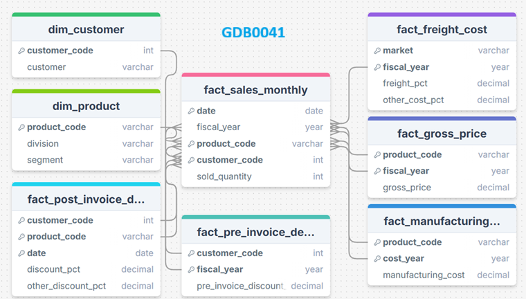

# AtliQ Hardwares Sales and Finance Analytics Project (SQL)

### 🧩 Domain: Retail / Consumer Electronics  
### 💼 Function: Sales & Finance Analytics  
### 🛠 Tools: SQL (MySQL)

---

## 📌 Table of Contents
- <a href="#overview">Project Overview</a>
- <a href="#business-problem">Business Problem</a>
- <a href="#dataset">Dataset</a>
- <a href="#tools--technologies">Tools & Technologies</a>
- <a href="#powerbi-features">Power BI Features</a>
- <a href="#data-model">Data Model</a>
- <a href="#sql-scripts">SQL Scripts</a>
- <a href="#reports-created">Reports Cretaed</a>
- <a href="#key-learnings">Key Learnings</a>
- <a href="#folder-structure">Folder Structure</a>
- <a href="#future-improvement">Future Improvement</a>
- <a href="#author--contact">Author & Contact</a>

---

<h2>Overview</h2>
AtliQ Hardware is a leading tech company that brings computer hardware like mice, keyboards, PCs, and 
printers to customers across the country. What makes AtliQ stand out is its wide network of sales channels — 
from trusted retailers and direct sales to popular distributors such as Croma, Amazon, AtliQ e-Store, 
AtliQ Exclusive outlets, and NEPTUNE. Through this diverse reach, AtliQ ensures that quality hardware products 
are accessible to customers wherever they are.

---

<h2>Business Problem</h2>
This project analyzes the sales performance of **Croma India** (a customer of AtliQ Hardwares) using SQL.  
The goal is to generate insights into gross sales across months, fiscal years, and markets.

---

<h2>Dataset</h2>
The dataset used for this analysis comes from the Gdb0041 schema, which contains around 2 million records.
Working with such a large volume of data helped simulate real-world business scenarios, making SQL optimization and 
query efficiency an important part of the project.

---

### 🗄️ gdb0041  

- **fact_sales_monthly**  
  - Monthly actual sales quantities  
  - Helps track performance against forecast 
  
- **fact_forecast_monthly**  
  - Monthly demand forecasts by customer  
  - Used to compare forecast vs. actual sales for inventory planning   
  
- **fact_gross_price**  
  - Contains gross price details for each product and customer 
  - Useful for calculating revenue and gross sales value 
  
- **fact_freight_cost**  
  - Stores transportation and logistics costs 
  - Helps analyze delivery expenses and profit margins 
  
- **fact_manufacturing_cost**  
  - Includes per-unit production or manufacturing cost  
  - Supports cost analysis and margin calculations
  
- **fact_post_invoice_deductions**  
  - Records deductions applied after invoicing (e.g., trade discounts, rebates)
  - Used to determine net sales and profitability
  
- **fact_pre_invoice_deductions**  
  - Captures deductions made before invoicing (e.g., promotions, early payment discounts)  
  - Helps estimate adjusted billing amounts before final sales 
  
- **dim_customer**  
  - Contains customer attributes like region, market, and channel  
  - Enables segmentation and market-level performance analysis 
  
- **dim_product**  
  - Holds product details such as category, division, and variant
  - Supports product-wise and category-wise sales insights 

- **dim_date**  
  - Calendar dimension with day, month, quarter, and fiscal year mapping
  - Essential for time-series and trend analysis 

---

<h2>Tools & Technologies</h2>

- SQL  
- GitHub

---

<h2><a class="anchor" id="data-model">Data Model</a></h2>

A well-structured Star schema for efficient querying and optimized performance.  

---

<h2><a class="anchor" id="sql-scripts">SQL Scripts</a></h2>
- [overview_report.sql](scripts/Report_Overview_Croma_India(2021).sql)
- [gross_monthly_sales.sql](scripts/Gross_Monthly_Total_Sales_Report_for_Croma.sql)
- [yearly_sales_report.sql](scripts/Yearly_Report_for_Croma_India.sql)

---

<h2><a class="anchor" id="reports-created">Reports Created</a></h2>

1. **Report Overview – Croma India (FY 2021)**  
   Summarizes overall performance metrics for FY 2021.
   - [Report Overview Croma India 2021](reports/report_overview_croma_india.csv)

2. **Gross Monthly Total Sales Report**  
   Displays month-wise gross sales trends for Croma India.
   - [Gross Monthly Sales Report](reports/gross_monthly_total_sales_croma_india.csv)

3. **Yearly Sales Report**  
   Shows fiscal year vs total gross sales to understand long-term performance.
   - [Yearly Sales Report](reports/yearly_sales_report_croma.csv)

4. **Stored Procedure – Market Badge**  
   Automates market segmentation logic based on market and financial year.

---

<h2><a class="anchor" id="key-learnings">Key Learnings</a></h2>

- Used `GROUP BY`, `JOIN`, and `CASE WHEN` for financial year logic.  
- Designed reusable stored procedures for market-level analysis.  
- Built sales reports aligned with business KPIs.

---

<h2><a class="anchor" id="folder-structure">Folder Structure</a></h2>

AtliQ_Hardwares_Sales_Analytics_SQL/
│
├── overview_report.sql
├── gross_monthly_sales.sql
├── yearly_sales_report.sql
├── market_badge_stored_procedure.sql
└── README.md

---

<h2><a class="anchor" id="future-improvement">Future Improvement</a>
- Add Power BI dashboard to visualize SQL outputs.  
- Automate reports using Python scripts.

---
<h2>Author & Contact</h2>

**Rita Mahato**  
Aspiring Data Analyst  
📧 Email: ritamahato.analytics@gmail.com  
🔗 [LinkedIn](https://www.linkedin.com/in/mahato-rita/)  
